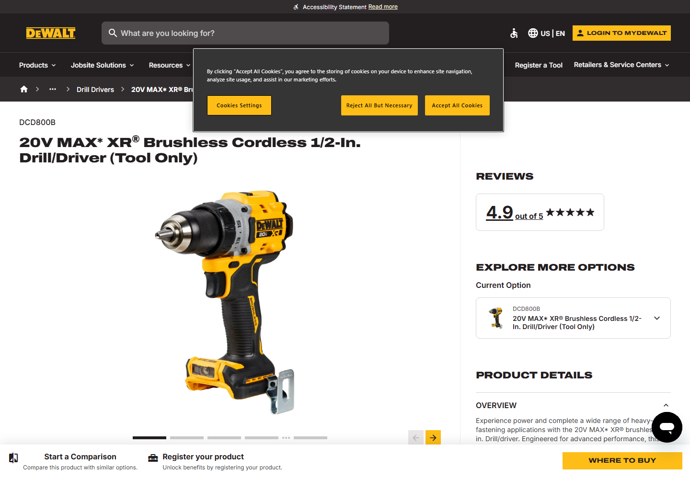
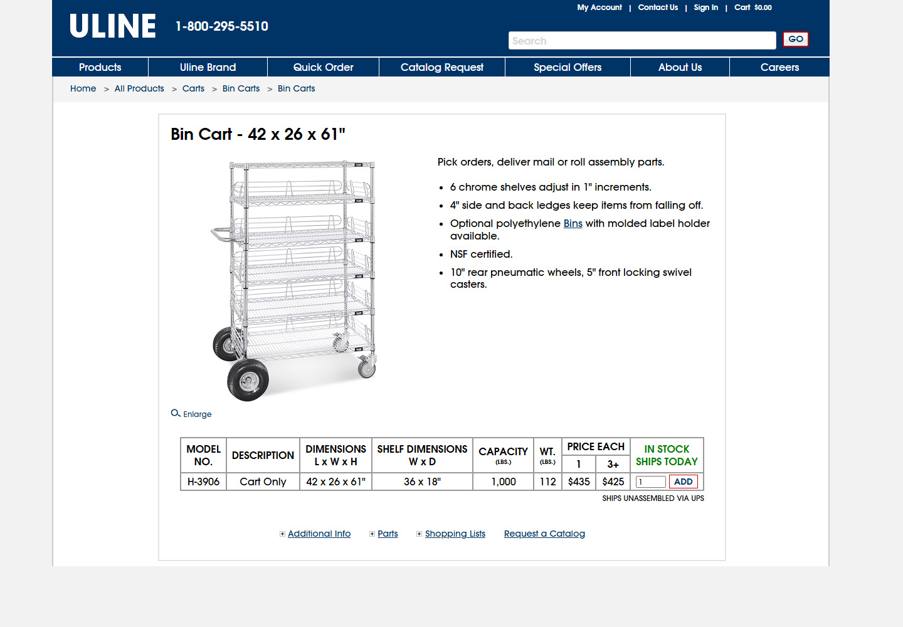
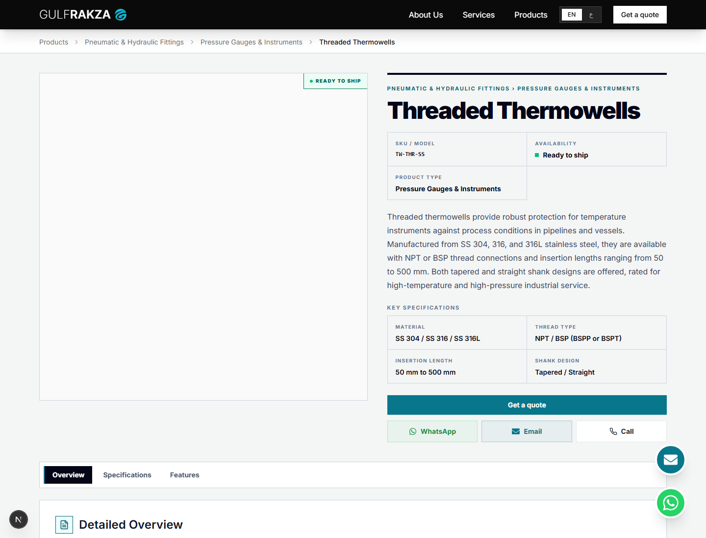
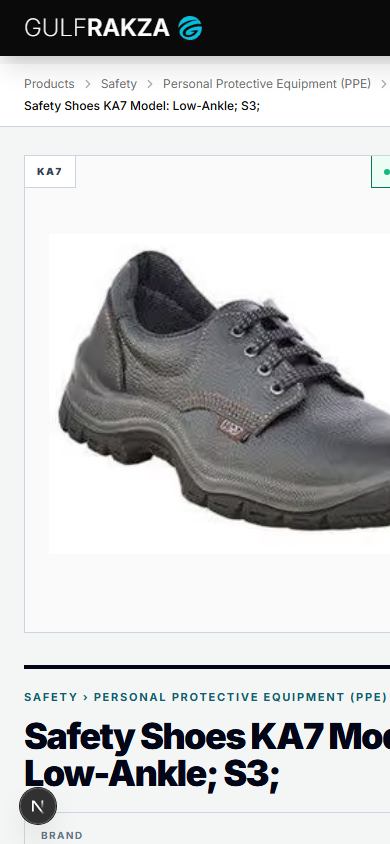
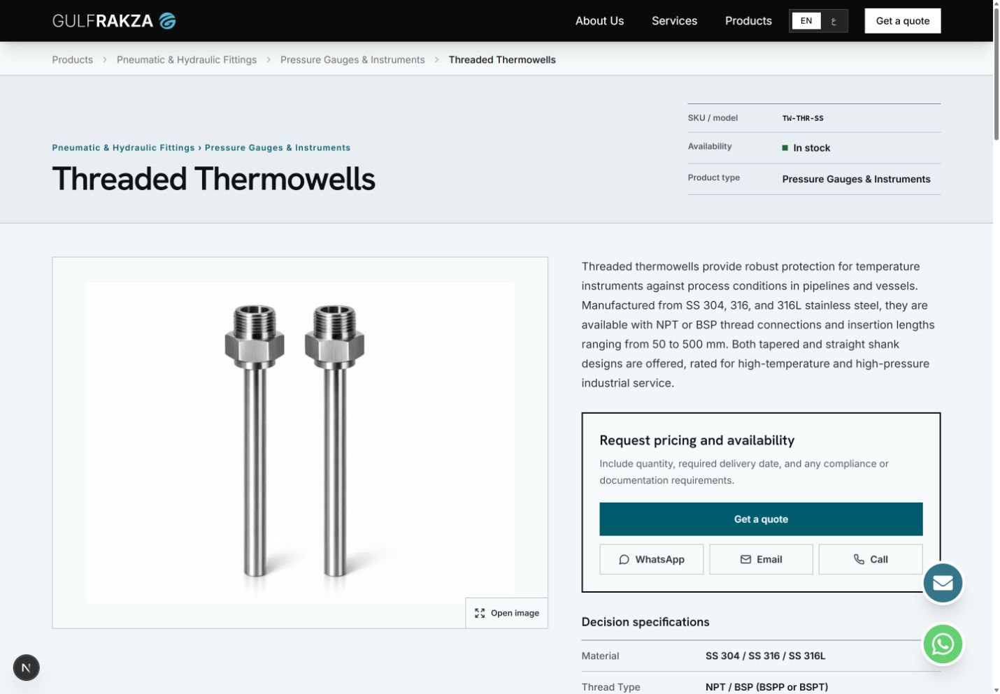
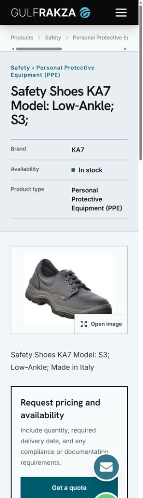

# GulfRakza product-detail UX case study

Research date: 25 August 2026

Scope: individual product-detail pages for the English and Arabic GulfRakza catalog
Primary user: a KSA procurement, maintenance, safety, or engineering buyer who needs to verify fit and request a quotation

## Outcome

The product page should behave like a technical decision sheet, not a consumer retail landing page. Its sequence is:

1. Confirm the exact product, model, category, and availability state.
2. Inspect a clear product image without relying on hover.
3. Verify the few specifications that decide whether the item fits the job.
4. Send quantity, delivery-date, and documentation requirements in a quotation request.
5. Continue into full technical content, documents, or closely related products.

The redesign preserves GulfRakza's two-level category model, Sanity content, crawlable routes, inquiry modal, analytics events, canonical metadata, and server-rendered structured data.

## Research set

The review covered current product-page research, industrial catalog pages, manufacturer pages, KSA procurement context, search guidance, and accessibility requirements.

| Source | Pattern reviewed | Decision for GulfRakza |
| --- | --- | --- |
| [Baymard Product Page UX research](https://baymard.com/research/product-page) | 110+ PDP findings; product layout, galleries, buy areas, variants, descriptions, specification sheets, auxiliary content, and cross-navigation | Use a visible technical index, a strong image surface, decision specs near the action, and a full readable spec sheet |
| [Hilti TE 4-22](https://www.hilti.com/c/CLS_POWER_TOOLS_7125/CLS_ROTARY_HAMMERS_7125/r13250308) | Concise product definition, three key specs, configurator, technical data, documents, features/applications, related products | Put identity and decision specs first; keep documents and related items easy to reach |
| [Grainger ESS Safety Goggles](https://www.grainger.com/product/ESS-Safety-Goggles-Clear-Gray-52TA95) | Item number, manufacturer model, dense labeled attributes, standards, description, availability/action | Treat SKU/model and specifications as primary procurement data, not secondary metadata |
| [DigiKey ATSAM4S4BB-MN](https://www.digikey.com/en/products/detail/microchip-technology/ATSAM4S4BB-MN/7644898) | Exact identifiers, concise description, datasheet near identity, dense attribute table, technical support | Keep documents adjacent to the decision area and present attributes in label/value rows |
| [Uline Bin Cart H-3906](https://www.uline.com/Product/Detail/H-3906/Bin-Carts/Bin-Cart-42-x-26-x-61) | Direct description, operational bullets, model table, dimensions, compatibility, capacity, manuals/parts | Use practical, scannable content and avoid decorative marketing sections |
| [McMaster made-to-order spacers](https://www.mcmaster.com/products/fasteners/length~made-to-order/) | Selection data, material guidance, certificates, exact configuration ranges | Let technical choices carry the page; surface certificates/resources only when the data exists |
| [DEWALT DCD800B](https://www.dewalt.com/product/dcd800b/20v-max-xr-brushless-cordless-12-drilldriver-tool-only) | Product ID, outcome-led bullets, overview, specifications, downloads | Pair the exact model with concise features and a complete spec list |
| [3M SecureFit 600](https://www.3m.com/3M/en_US/p/d/b10277110/) | Options, highlights, typical properties, resources, support, similar-product comparison | Keep variant and compliance content factual; do not invent reviews or standards |
| [Honeywell Uvex Polysafe](https://automation.honeywell.com/us/en/products-backup/personal-protective-equipment/eye-protection/safety-eyewear/uvex-polysafe-and-polysafe-plus) | Image gallery, certifications, fit/protection groups, specifications, brochure | Give safety products room for certification and fit data when Sanity actually contains it |
| [AP Tools Saudi product catalog](https://aptools.sa/en/product-catalog/11670-00000-20) | Regional Dammam/KSA procurement context and compact catalog records | Preserve an RFQ-first model and make sparse records still usable |
| [RAF Safety KSA eye protection](https://therafsafety.com/product-category/safety-goggles-ksa/) | Application-led selection guidance, wholesale language, product models, local fulfillment context | Ask for quantity and requirements rather than pretending every product has an online checkout path |
| [Google Product structured data](https://developers.google.com/search/docs/appearance/structured-data/product) | Single-product focus, initial-HTML recommendation, product/variant rules | Keep one `Product` entity per page in server-rendered HTML and do not add fake price, rating, or offer data |
| [Google image SEO guidance](https://developers.google.com/search/docs/appearance/google-images) | Crawlable ``, useful alt text, responsive images, high quality, speed, representative metadata image | Use Next Image, descriptive product alt text, a 1600×1200 Sanity source, and eager/high-priority loading for the main image |
| [Google AI-search guidance](https://developers.google.com/search/docs/appearance/ai-features) | No special AI schema or AI-only file; indexed text, internal links, page experience, images, accurate structured data | Improve factual visible content and internal linking; do not add “AIO” markup that Google does not request |
| [Google generative-AI optimization guide](https://developers.google.com/search/docs/fundamentals/ai-optimization-guide) | Core SEO remains foundational; unique, non-commodity content helps AI features | Make product descriptions, specifications, documents, applications, and review provenance genuinely useful |
| [WCAG 2.2 target-size guidance](https://www.w3.org/WAI/WCAG22/Understanding/target-size-minimum.html) | Minimum target sizing and spacing | Keep gallery, modal, navigation, and contact controls at least 44 CSS pixels where touch is expected |

## Reference captures

The visual review retained two representative examples rather than treating their styling as a template. DEWALT demonstrates prominent identity, imagery, variants, and a clear action rail; Uline demonstrates a compact industrial decision sheet with operational bullets and model/specification data close to the action.

## Existing-page audit

### What was already good

- One crawlable URL and one `h1` per product.
- Server-rendered `Product` and `BreadcrumbList` JSON-LD.
- Canonical and language-alternate metadata.
- Sanity-driven summary, specifications, features, variants, gallery, resources, SEO fields, and optional review provenance.
- A direct quotation action plus WhatsApp, email, and phone alternatives.
- Related-product cross-navigation.

### What weakened the experience

- On mobile, the large square image appeared before the product name, forcing the buyer to scroll before confirming the item.
- Long product names could visually run into the viewport edge.
- Brand and availability were repeated both over the image and in the metadata grid.
- Image zoom was hover-only, so touch and keyboard users did not receive an equivalent experience.
- The page used several equal bordered cards and icon tiles, which made every section feel equally important.
- The horizontal section bar consumed width but did not create a strong technical-document hierarchy on desktop.
- “You might also like” sounded consumer-retail rather than procurement-oriented.
- Most interface copy was English even on the Arabic route.
- The existing in-stock label “Ready to ship” implied a fulfillment promise that the stored status alone cannot prove.

### Sanity content readiness

Read-only audit of the production dataset on 25 August 2026:

| Field state | Products |
| --- | ---: |
| Active products | 74 |
| SKU/model present | 47 |
| Specifications present | 52 |
| Features present | 52 |
| Detailed body present | 52 |
| Additional gallery images present | 2 |
| Downloadable resource present | 1 |
| Technical-review attribution present | 0 |

This means 22 active products are structurally sparse. The page must not leave fake empty panels or compensate with invented marketing claims.

## Before-state captures

Desktop, content-rich record:

Mobile, sparse record:

## After-state captures

Desktop, content-rich record:

Mobile, sparse record at 320 CSS pixels:

Additional responsive captures are stored at 375, 414, and 768 CSS pixels in `docs/pdp-research/`.

## Design decisions

### 1. Put identity before imagery

The title, category path, brand, SKU/model, availability, and product type now form a full-width technical header. This keeps the exact item visible before the gallery on every viewport and prevents the image from becoming the page's accidental headline.

### 2. Make the gallery device-independent

The main image opens a native dialog on click or keyboard activation. Previous/next controls are explicit, image count is visible, and the gallery no longer depends on pointer hover. The main Sanity image is requested at up to 1600×1200 while Next Image still serves responsive sizes.

### 3. Use a procurement decision rail

The right rail contains the summary, RFQ action, direct-contact alternatives, four decision specifications, size variants, and resources. The quotation panel is visible in the first desktop viewport instead of being buried below the specification preview. The rail remains sticky only on desktop, where there is enough room, and flows normally on smaller screens. A compact mobile quote action appears after the primary panel has passed and stays out of the way while that full panel is visible.

### 4. Replace equal cards with document hierarchy

Long-form content uses a desktop sticky index and a single continuous technical document. Overview, full specifications, features/applications, and review provenance are separated by rules and spacing rather than repeated icon cards.

### 5. Design the sparse case deliberately

If no detailed content exists, the header, image, summary, identifiers, RFQ action, and a short “ask us to confirm” note still form a complete page. Empty specification, feature, resource, and review sections are not rendered.

### 6. Keep claims honest

- “Ready to ship” became “In stock.”
- No price, delivery time, certification, rating, review, warranty, or offer is displayed unless Sanity provides a verified field for it.
- Product JSON-LD keeps factual product identity and properties but does not invent an `Offer` merely to chase a rich result.
- Review attribution remains hidden until a real reviewer or review date is stored.

### 7. Localize the interface

Navigation labels, availability, gallery controls, RFQ guidance, section labels, resources, review labels, and related-product language now switch with the page locale. Product content continues to use Sanity's reviewed locale/fallback rules.

## What to do next in Sanity

- [ ] Add manufacturer SKU/model wherever available.
- [ ] Add four decision-critical specifications before adding long marketing copy.
- [ ] Add a manufacturer datasheet or technical drawing when legally distributable.
- [ ] Add application/compatibility information that helps a buyer choose correctly.
- [ ] Add at least one alternate product view for products where fit, connection, scale, or geometry matters.
- [ ] Add a real technical reviewer and review date after claims are checked.
- [ ] Add accurate GTIN/MPN fields to the schema later if the business has those identifiers; do not map an internal SKU to GTIN.

## What not to do

- [ ] Do not generate repetitive descriptions at scale solely to increase word count.
- [ ] Do not add fake reviews, star ratings, prices, offers, certifications, lead times, or delivery guarantees.
- [ ] Do not hide decisive specifications inside PDFs only; keep important values as visible HTML too.
- [ ] Do not create separate variant pages unless a variant has a stable identity and direct URL worth indexing.
- [ ] Do not put specification values into images; they must remain searchable and accessible text.
- [ ] Do not add FAQ sections unless customers actually ask those questions and the answers are product-specific.
- [ ] Do not add “AI-optimized” schema or an AI-only crawl file; Google explicitly says the existing SEO fundamentals apply.

## Test gates

### Gate 1 — content integrity

- [x] Rich product renders overview, full specifications, features, and resources only when present.
- [x] Sparse product renders no empty cards or blank headings.
- [x] Category trail, brand, SKU/model, availability, and product type match Sanity.
- [x] Quote form receives the correct two-level category path.

### Gate 2 — interaction and accessibility

- [x] Main image opens by mouse, touch, Enter, and Space.
- [x] Native dialog closes with its button, backdrop click, and Escape.
- [x] Arrow keys and explicit controls move through a multi-image gallery.
- [x] All visible controls have a keyboard focus indicator.
- [x] Touch controls are at least 44×44 CSS pixels.
- [x] No decisive information exists only on hover or only by color.

### Gate 3 — responsive layout

- [x] Check 320, 375, 414, and 768 CSS-pixel widths.
- [x] Product title appears before the gallery.
- [x] Long names and SKUs wrap without horizontal scrolling.
- [x] Breadcrumbs scroll horizontally rather than wrapping each link.
- [x] CTA labels remain one line.
- [x] Technical navigation is horizontal on small screens and vertical/sticky on desktop.

### Gate 4 — SEO and AI-search readiness

- [x] Exactly one visible `h1` describes the product.
- [x] Title, description, canonical, and locale alternates are present in initial HTML.
- [x] `Product` JSON-LD matches visible name, description, brand, SKU/model, images, category, and specifications.
- [x] No `Offer`, `AggregateRating`, or `Review` is emitted without matching visible factual data.
- [x] `BreadcrumbList` URLs match crawlable category/product routes.
- [x] Main product image has descriptive alt text and a crawlable `src`.
- [x] Related products use ordinary crawlable links.

### Gate 5 — engineering quality

- [x] ESLint passes.
- [x] TypeScript passes without emit.
- [x] Production build passes.
- [x] Local rich and sparse pages return HTTP 200.
- [x] Browser console contains no page errors.
- [x] After-state screenshots are visually reviewed at desktop and mobile widths.
